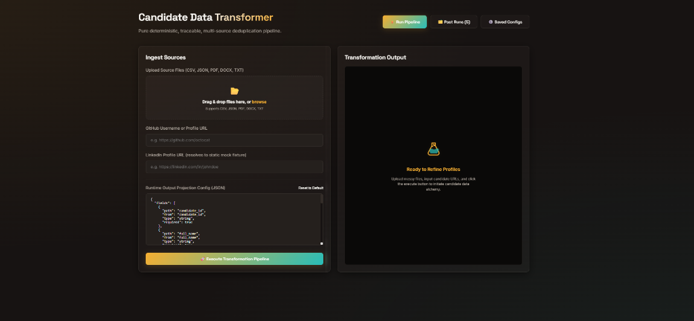
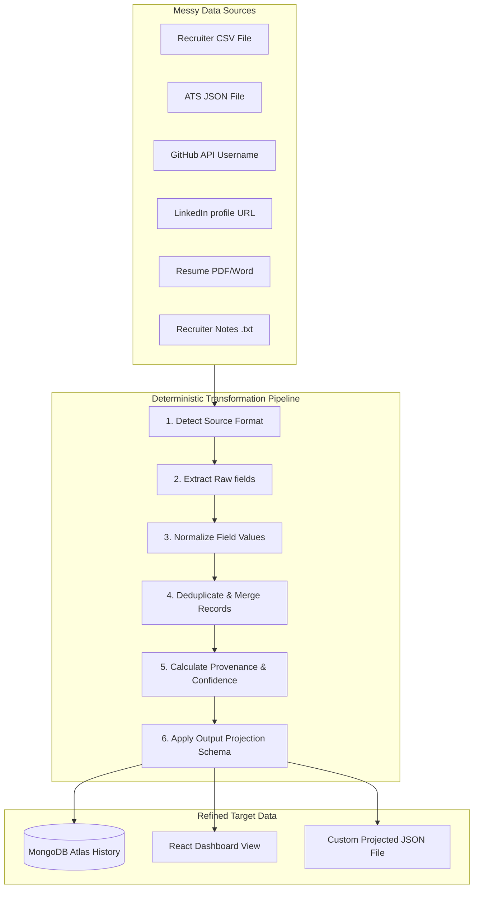

# 🔮 Multi-Source Candidate Data Transformer ("Data Alchemy")

A full-stack, single-monorepo application designed to ingest candidate profiles from multiple structured and unstructured sources, deduplicate them into a single canonical record with complete provenance tracking, and project them into custom output shapes using dynamic runtime configurations.

---

## 🖼️ Application Screenshot

Here is the design mockup of the alchemical user interface:



---

## ⚙️ Data Alchemy Workflow

The deduplication pipeline runs as a series of pure, deterministic functions, transforming messy, raw inputs into refined, canonical profiles:



---

## 🚀 Key Features

1. **Pure Data Ingestion Pipeline**: Ingests, parses, and normalizes unstructured strings, binary PDFs, Word documents, and structured tables without side effects.
2. **Deterministic Deduplication**: Merges candidate profiles by correlating normalized E.164 phone numbers, lowercased email addresses, or fuzzy name similarity.
3. **Traceability & Provenance**: Tracks the origin of every single field value down to the file name and the merge rule applied.
4. **Dynamic Output Projection**: Filters, renames, and formats canonical schemas into custom JSON shapes dynamically at runtime using custom JSON config templates.
5. **Real-time Health Diagnostics**: Detects backend server liveness and MongoDB connectivity, displaying alerts and status details on the fly.

---

## 🛠️ Technology Stack

- **Frontend**: React + Vite (Custom Glassmorphic "Data Alchemy" Warm Dark Theme)
- **Backend**: Node.js + Express (Modern ES Modules, Stateless controllers)
- **Database**: MongoDB via Mongoose (with database liveness connection flags)
- **Engines**: 
  - `papaparse` (CSV Parser)
  - `pdf-parse` (PDF text extractor)
  - `mammoth` (DOCX converter)
  - `fuse.js` (Fuzzy name & skill matcher)
  - `zod` (Zod schemas for projection validation)
- **Testing**: Vitest

---

## 📦 Setup & Installation

### Prerequisites
- **Node.js** (v18 or higher recommended)
- **MongoDB** (A local MongoDB service running on port 27017, OR a cloud-based MongoDB Atlas cluster URI)

### Setup Commands
1. **Clone the repository** and navigate to the project folder.
2. **Install all dependencies** for both backend and frontend from the monorepo root:
   ```bash
   npm run install:all
   ```
3. **Create the Environment Config**:
   Create a `.env` file inside the `server/` directory:
   ```bash
   # From the server directory
   cp .env.example .env
   ```
   Modify `server/.env` to configure your connection string:
   ```env
   PORT=5000
   MONGO_URI=mongodb+srv://<username>:<password>@<cluster>.mongodb.net/candidate_db?appName=Cluster0
   ```

---

## 🏃 Run Instructions

### Starting the Server & Client Together (Recommended)
You can launch both services concurrently from the repository root:
```bash
npm run dev
```
This boots:
- **Frontend Dashboard**: [http://localhost:3000](http://localhost:3000)
- **Backend API Server**: [http://localhost:5000](http://localhost:5000)

### Starting Services Separately
If you need isolated console outputs:
1. **Start Backend**:
   ```bash
   cd server
   npm start
   ```
2. **Start Frontend**:
   ```bash
   cd client
   npm run dev
   ```

---

## 🖥️ Command Line Interface (CLI)

The transformer can run directly in the terminal over local files.

```bash
# Run over raw files and save output:
npm run cli -- run --sources ../samples/recruiter_sample.csv,../samples/ats_sample.json --out ./output.json

# Run with a custom projection config schema:
npm run cli -- run --sources ../samples --config ../config.example.json --out ./projected_output.json

# Run pipeline locally without writing to the database:
npm run cli -- run --sources ../samples --out ./output.json --no-persist
```

---

## 🧪 Testing

Run the full Vitest suite to verify parsing and pipeline regression correctness:

```bash
cd server
npm run test
```

---

## 🧠 Design Rules & Assumptions

1. **No-Fabrication LinkedIn Rule**: LinkedIn URLs degrade gracefully to empty fields with `raw_confidence: 0` if no fixture matches, preventing the pipeline from inventing candidate data. Derivable name slugs are guessed at a low confidence score of `0.3`.
2. **Conflict Resolution Order**: Disagreements in field values prefer the source with the highest confidence. Ties fall back to the default priority order:
   `ats_json > recruiter_csv > linkedin_json > github_api > resume > recruiter_notes`
3. **Graceful Database Failover**: Database persistence runs completely decoupled from the data extraction engine. If MongoDB is stopped, pipeline runs continue to execute in-memory.
